# SARAH system workflow

This is the current workflow, also shown in the [updated architecture diagram](figures/SARAH_System_Architecture_Diagram_Final%20Version.png). [Jackie's original diagram](figures/SARAH_system_architecture.drawio.png) is historical design evidence. Confirmatory requires G1 and accepts optional G2. The current code uses the three separately trained models shown below.

```mermaid
flowchart TD
    A[Choose mode and enter a student or class CSV] --> B[Check required fields and values]
    B -->|Invalid CSV structure| C[Explain the file error]
    B -->|Invalid student row| D[Skip row and explain; continue valid rows]
    B -->|Valid student| E{Mode and available grades}
    E -->|Early-Warning: no grades| F[Early-Warning model]
    E -->|Confirmatory: G1 only| G[G1-only model]
    E -->|Confirmatory: G1 and G2| H[G1+G2 model]
    F --> I[Risk label and estimated High-Risk probability]
    G --> I
    H --> I
    I --> J[Tutor reviews the result]
    I -. Planned .-> K[Rule-based support suggestion]
    K -. Planned .-> L[Dashboard displays results and skipped rows]
    L -.-> J
```

- Attendance estimate: 0-100; study hours: 0-40; failures: whole number 0-3.
- Confirmatory grades are entered out of 20. Blank G2 is allowed; invalid supplied G2 is rejected. Zero is a valid grade.
- G3 defines the training label and is never a prediction input.
- Single-student and CSV predictions work through the command line. The dashboard and recommendations are still planned.
- Recommendation rules will suggest support based on agreed inputs. They will not prove why the model predicted High Risk.
- Early-Warning means no assessment grades are used. The dataset does not establish day-one or week-specific accuracy.

See [system design](SYSTEM_DESIGN.md), [mode guide](mode-guide.md) and [test plan](model-test-plan.md).
