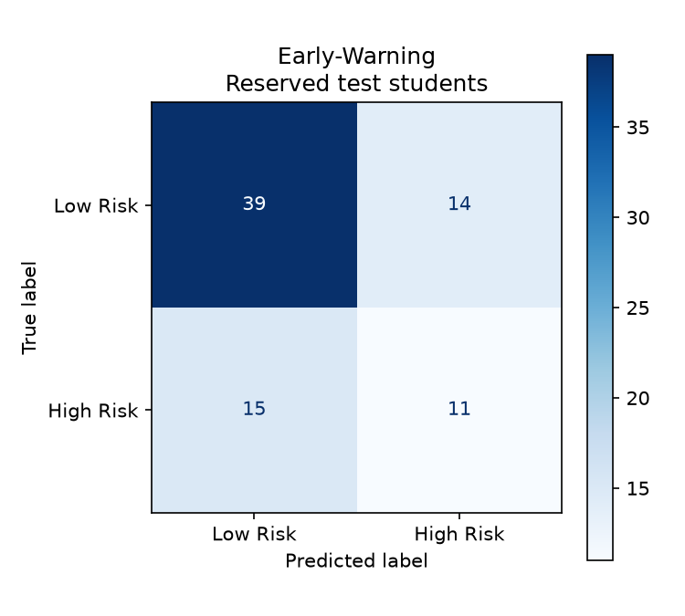
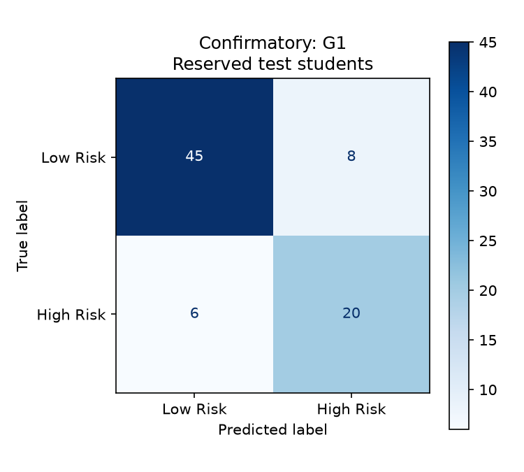
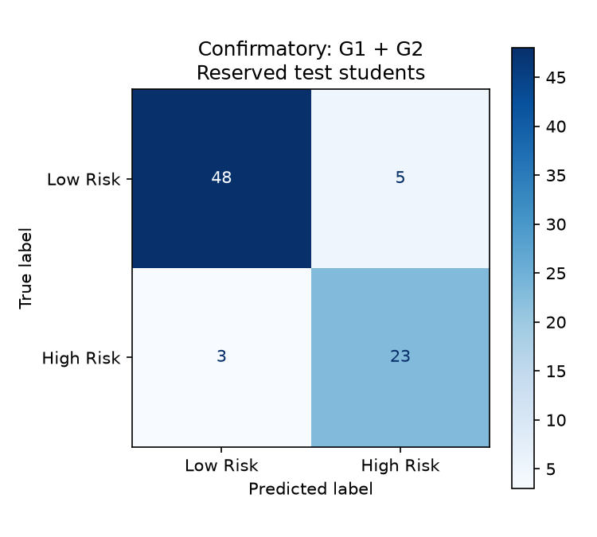
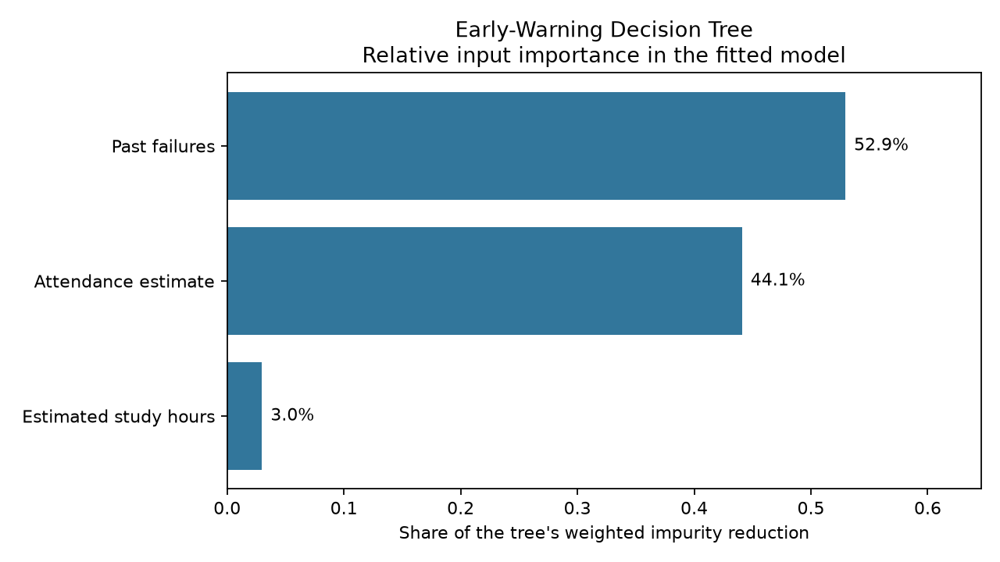

# SARAH model comparison and discussion

## Purpose and method

We compared Logistic Regression and Decision Tree for academic-risk classification. Logistic Regression gives a relatively simple statistical model, while a Decision Tree can represent branching rules and nonlinear relationships. Both suit our small tabular prototype, but neither guarantees reliable performance for a new school or cohort.

There are two user modes and three trained setups: Early-Warning without grades, Confirmatory with G1, and Confirmatory with G1 and G2. Each technique was tried with normal and balanced class weights, giving 12 comparisons. G3 below 10 defines High Risk; G3 is not an input.

The existing experiment first reserved 79 of 395 students using a stratified split and seed 42. The other 316 students were used for five-fold development validation. The same groups were used across setups. This script reads those recorded development results and checks the saved models on the same reserved students. It does not retrain, tune models or provide a new independent test.

## Development comparison

| Setup | Technique | Weight | Accuracy | Precision | Recall | F1 |
| --- | --- | --- | --- | --- | --- | --- |
| early_warning | Logistic Regression | None | 0.696 | 0.7 | 0.212 | 0.311 |
| early_warning | Logistic Regression | balanced | 0.7 | 0.573 | 0.397 | 0.454 |
| early_warning | Decision Tree (depth=4) | None | 0.703 | 0.657 | 0.299 | 0.4 |
| early_warning | Decision Tree (depth=4) | balanced | 0.617 | 0.422 | 0.482 | 0.444 |
| confirmatory_g1 | Logistic Regression | None | 0.855 | 0.776 | 0.79 | 0.78 |
| confirmatory_g1 | Logistic Regression | balanced | 0.829 | 0.707 | 0.838 | 0.765 |
| confirmatory_g1 | Decision Tree (depth=4) | None | 0.839 | 0.818 | 0.646 | 0.719 |
| confirmatory_g1 | Decision Tree (depth=4) | balanced | 0.798 | 0.663 | 0.838 | 0.728 |
| confirmatory_g1_g2 | Logistic Regression | None | 0.889 | 0.832 | 0.828 | 0.829 |
| confirmatory_g1_g2 | Logistic Regression | balanced | 0.864 | 0.745 | 0.904 | 0.815 |
| confirmatory_g1_g2 | Decision Tree (depth=4) | None | 0.893 | 0.824 | 0.857 | 0.839 |
| confirmatory_g1_g2 | Decision Tree (depth=4) | balanced | 0.87 | 0.766 | 0.876 | 0.814 |

Accuracy measures all correct predictions. Precision measures how many flagged students were actually High Risk. Recall measures how many High-Risk students were found. F1 combines precision and recall. In these results, balanced weights improved recall but reduced precision in every setup for both techniques, meaning more students were found but more false alarms occurred.

## Selected models

| Setup | Technique | Weight | Development recall | Development F1 |
| --- | --- | --- | --- | --- |
| Early-Warning | Decision Tree (depth=4) | balanced | 0.482 | 0.444 |
| Confirmatory: G1 | Logistic Regression | balanced | 0.838 | 0.765 |
| Confirmatory: G1 + G2 | Logistic Regression | balanced | 0.904 | 0.815 |

Selection follows the existing code: highest development recall, then highest F1, using scores rounded to three decimals. Finding students who may need support was prioritised over avoiding every false alarm. For G1-only, both balanced techniques had recall 0.838; Logistic Regression won the tie with F1 0.765 rather than 0.728. For Early-Warning, the tree's higher recall was preferred even though balanced Logistic Regression had a slightly higher F1.

The shared tree depth was chosen from 2, 3, 4, 5, 6 and no limit using balanced Early-Warning development recall. Depth 4 scored highest at 0.482. It was reused for all tree comparisons; this does not establish that depth 4 is optimal for every setup.

## Reserved test results and baseline

| Setup | Accuracy | Precision | Recall | F1 | Correct Low | False alarms | Missed High | Found High |
| --- | --- | --- | --- | --- | --- | --- | --- | --- |
| Early-Warning | 0.633 | 0.44 | 0.423 | 0.431 | 39 | 14 | 15 | 11 |
| Confirmatory: G1 | 0.823 | 0.714 | 0.769 | 0.741 | 45 | 8 | 6 | 20 |
| Confirmatory: G1 + G2 | 0.899 | 0.821 | 0.885 | 0.852 | 48 | 5 | 3 | 23 |

Always predicting Low Risk gives accuracy 0.671, precision 0.000, recall 0.000 and F1 0.000 on these students. Precision is reported as zero by convention because it flags nobody. It correctly labels 53 of 79 students but misses all 26 High-Risk students. Early-Warning accuracy (0.633) is below this baseline, although it finds 11 of the 26 High-Risk students. It also misses 15 and incorrectly flags 14 Low-Risk students. This is a substantial limitation, not evidence that the prototype is ready for deployment.

G1-only finds 20 High-Risk students, misses 6 and produces 8 false alarms. G1 plus G2 finds 23, misses 3 and produces 5 false alarms. Grades improve performance in this experiment, but waiting for them reduces how early the result can be available.

Rows in these matrices are actual classes; columns are predicted classes. False negatives are missed High-Risk students, and false positives are false alarms.

## Feature-importance chart and explanation

| Input | Relative importance |
| --- | --- |
| Past failures | 52.9% |
| Attendance estimate | 44.1% |
| Estimated study hours | 3.0% |

The largest importance belongs to past failures (52.9%). This means it contributed the largest share of weighted impurity reduction across splits in this fitted tree. The values sum to 100%; they are not changes in a student's risk probability. This chart describes the Early-Warning tree only and does not explain every individual prediction.

The chart does not show whether an input increases or decreases risk, prove causation, or tell us that changing that input will improve grades. Tree importance can favour variables with more possible split values, and related inputs can share importance. Values may change with a different sample. Raw Logistic Regression coefficients are not ranked here because the inputs have different scales and the current model has no StandardScaler.

## Limitations and next steps

- This experiment contains only 395 Math-course students and one fixed 79-student test split. Results are uncertain and may not transfer to another cohort or institution.
- The data has no week-by-week records. Early-Warning means without grades, not proven day-one accuracy. Inputs intended for an early prediction would need to be collected by that time.
- Attendance is estimated from capped absence counts, not measured attendance percentage. Study hours are estimates from categories, including an assumed value for the highest category. The 40-hour input limit is a validation rule, not a range established by the training data.
- High Risk is defined using G3 below 10. It is a narrow academic outcome and does not capture every support need.
- Logistic Regression currently has no scaling. Different input scales affect coefficient interpretation and regularisation. A future comparison could fit scaling inside each training fold.
- The tree depth was selected and scored using the same development folds. Those development scores may be optimistic after selection. The reserved test was excluded from that choice. A fuller future study could use nested validation and repeated splits, without tuning against the current test results.
- Balanced class weights trade extra false alarms for fewer missed students. The team should discuss both costs with the tutor rather than claim recall alone proves practical usefulness.
- Predicted probabilities have not been checked for calibration, and subgroup fairness has not been established. Results should support human review, not automatic decisions about students.
- These model results describe the classification baseline. The project now includes a dashboard and rule-based recommendations; their software and user checks are separate from model accuracy.

## Output files

The CSV files contain the development comparisons, reserved-test results and feature importances. The report reuses the three existing confusion matrices in figures/; only the feature-importance chart is generated here. Development results and reserved-test results describe different stages of the same experiment.

## Sources

- Existing team files: project/docs/evaluation_report.md, project/code/train_models.py, project/code/data_processing.py and the three project/models/*_model.joblib files.
- UCI Student Performance dataset: https://doi.org/10.24432/C5TG7T
- Scikit-learn tree importance example and cautions: https://scikit-learn.org/stable/auto_examples/ensemble/plot_forest_importances.html
- Scikit-learn coefficient interpretation: https://scikit-learn.org/stable/auto_examples/inspection/plot_linear_model_coefficient_interpretation.html
