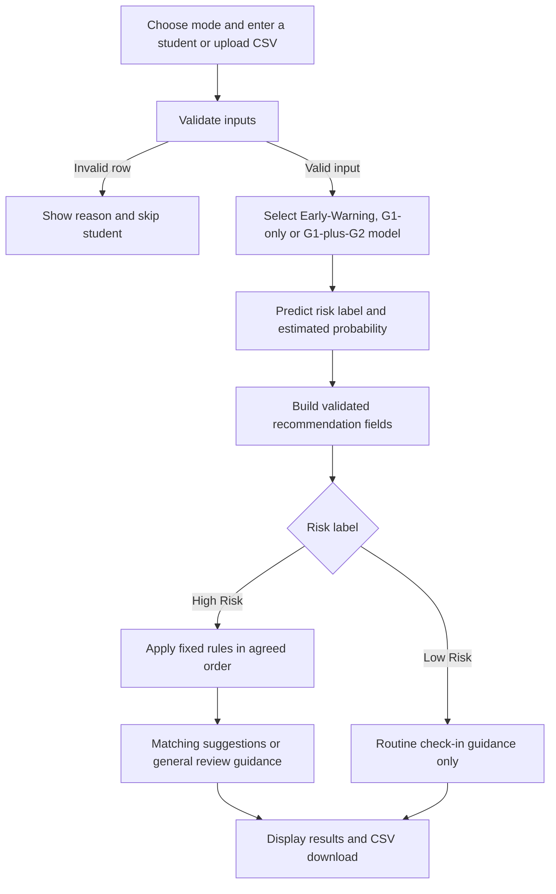

# Current project workflow

The form and CSV dashboard were merged in PR #72. The team-approved rules were
merged in PR #73 and the recommendation function in PR #74.

The dashboard preserves each CSV row's identity internally, even when student
IDs repeat. Skipped rows receive no prediction or recommendation. A missing
required column or empty file produces a file error.

Confirmatory requires G1; G2 may be blank or zero. Previous score is G1 times 5,
or the G1/G2 average times 5. Early-Warning uses no grades. G3 is never an input.

The [rules](recommendation-rules.md) are fixed and do not change the model's
prediction. Suggestions support human review and do not establish causation.
The team approves the rules; tutors use the system and provide prototype feedback.

The model baseline remains in [evaluation_report.md](evaluation_report.md).
[Issue #56](prototype-test-checklist.md) records full workflow checks;
[issue #57](prototype-demo-notes.md) records the demonstration and feedback.
Deployment/maintenance, the final user guide and demo video remain Phase E work.
